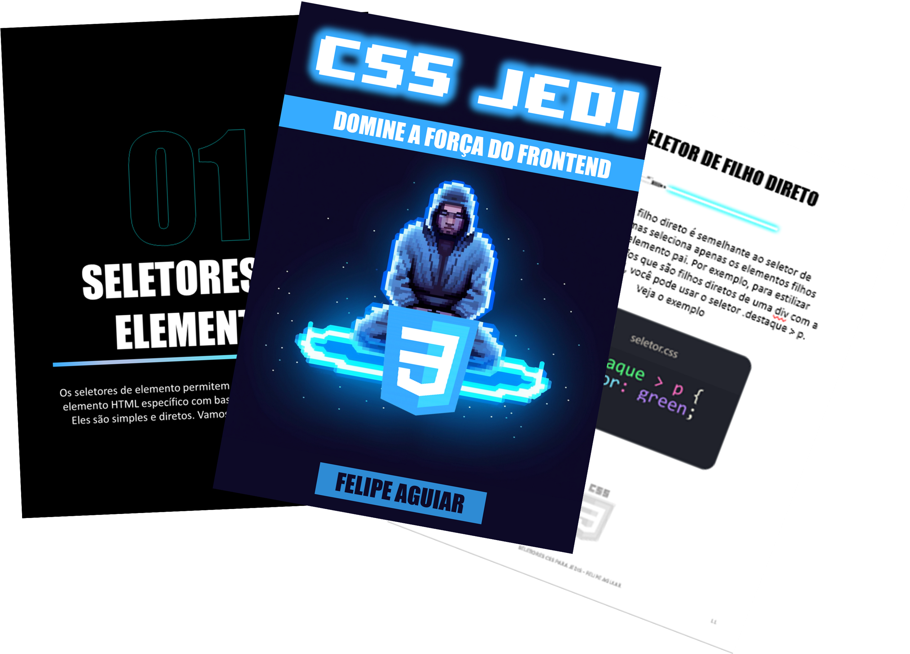

# prompts-recipe-to-create-a-ebook-DIO

## Projeto com o objetivo de gerar um ebook digital com as facilidades das ferramentas de IA

    

 

    
    
    
    

## Um ebook , com foco em CSS, listando os principais seletores CSS com exemplos em código e suas regras.

## 💻 Tecnologias utilizadas no projeto

- [ChatGPT](https://www.microsoft.com/pt-br/microsoft-copilot/) 